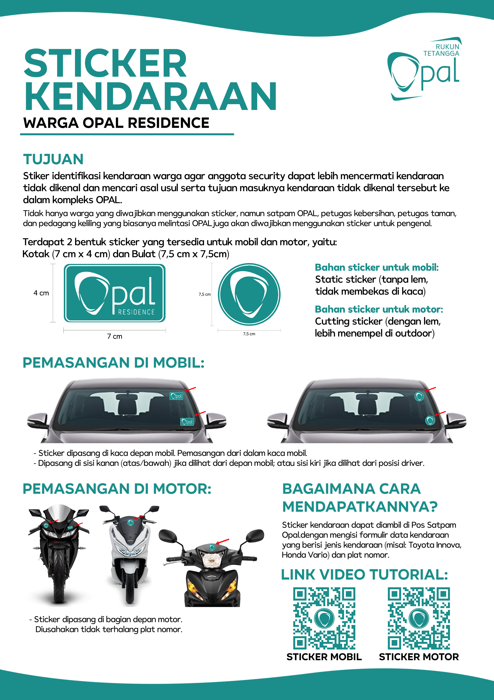
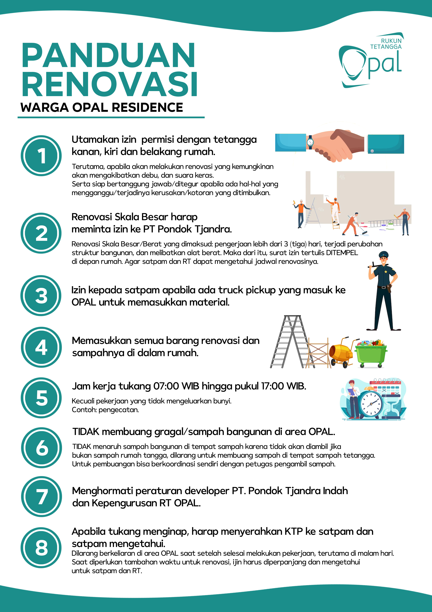

## Panduan Harmonis Opal Residence

### Iuran Warga Opal Residence

Pada dasarnya terdapat 2 jenis iuran bulanan yang secara rutin harus dibayar oleh warga Opal Residence, antara lain:

**1. Iuran Pondok Tjandra**

* **Rp 225.000** per bulan per rumah (bukan per KK) 
* Dibayarkan ke: **Pondok Tjandra Indah**
* Pembayaran secara tunai melalui pos satpam Opal.

Iuran ini digunakan untuk:

* Tim Keamanan
* Kebersihan Sampah
* Perawatan Taman

**2. Iuran Kas Opal**

* **Rp 25.000** per bulan per rumah (bukan per KK)
* Dibayarkan ke rekening kas Opal secara transfer ke No. Rekening: **Bank BCA 1011815125 A.N. Neria Kezia Jayanti**

Iuran ini digunakan untuk kas bersama Opal yang dikelola pengurus, yang digunakan untuk kepentingan bersama dan pengembangan fasilitas Opal.

* Instalasi CCTV
* Fogging
* Pembersihan Selokan
* Dan Fasilitas/Keperntingan Bersama Lainnya.

### Parkir Mobil

**Mobil #1: Wajib Masuk Carport**

Setiap warga wajib memasukkan mobilnya ke dalam carport rumah agar tidak terlalu mengganggu lalu lintas di jalanan, serta mencegah kemungkinan terjadinya penyempitan jalan akibat dua mobil bersebrangan satu sama lain.

**Mobil #2: Mepet Pembatas Tepi Jalan**

* Jika memang memiliki mobil ke-dua, wajib di parkir di depan rumah sendiri, dan di posisikan mepet dengan pembatas tepi jalan.
* Posisi mobil yang di parkir di depan rumah wajib mempertimbangkan keleluasaan warga seberang untuk memasukkan mobil ke dalam carport.
* Tidak mengambil hak warga lain, karena jalan adalah hak bersama. Bukan hak pemilik rumah meskipun itu di depan rumahnya.

**Mobil #3 DST dan Tamu: Rumah Kosong atau Pojok Gang**

* Bagi warga yang memiliki mobil ke-tiga, harap memarkirkan mobilnya tidak di depan rumah, melainkan di rumah kosong sekitar atau di bagian pojok gang agar tidak mengganggu keluar masuknya mobil tetangga.
* Mobil tamu dipersilahkan untuk juga diparkirkan di rumah kosong/tidak berpenghuni dan juga bisa di area pojok gang yang tidak mengganggu keluar masuk mobil warga lain. 

**Parkir Tidak Mengganggu Warga Lain**

* Karena jalanan adalah fasilitas umum, maka setiap mobil yang di parkir di jalanan kompleks OPAL, tidak boleh mengganggu aktifitas warga umum.
* Tenggang rasa dan saling pengertian adalah kunci utama agar tidak sampai terjadi permasalahan bertetangga dikarenakan parkir mobil.
* Apabila ada rumah berhadapan yang sama sama memiliki 2 mobil. Diharapkan bisa mengatur sendiri agar bisa janjian supaya tetap rukun.

### Sticker Kendaraan

**Tujuan**

Stiker identifikasi kendaraan warga agar anggota security dapat lebih mencermati kendaraan tidak dikenal dan mencari asal usul serta tujuan masuknya kendaraan tidak dikenal tersebut ke dalam kompleks OPAL.

Tidak hanya warga yang diwajibkan menggunakan sticker, namun satpam OPAL, petugas kebersihan, petugas taman, dan pedagang keliling yang biasanya melintasi OPAL juga akan diwajibkan menggunakan sticker untuk pengenal.

Terdapat 2 bentuk sticker yang tersedia untuk mobil dan motor, yaitu:

* Kotak (7 cm x 4 cm) 
* Bulat (7,5 cm x 7,5cm)

**Bahan sticker untuk mobil:**

* Static sticker (tanpa lem, tidak membekas di kaca)

**Bahan sticker untuk motor:**

* Cutting sticker (dengan lem, lebih menempel di outdoor)

**Pemasangan di Mobil:**

* Sticker dipasang di kaca depan mobil. Pemasangan dari dalam kaca mobil.
* Dipasang di sisi kanan (atas/bawah) jika dilihat dari depan mobil; atau sisi kiri jika dilihat dari posisi driver.

**Pemasangan di Motor:**

* Sticker dipasang di bagian depan motor.
* Diusahakan tidak terhalang plat nomor.

**Bagaimana Cara Mendapatkannya?**

Sticker kendaraan dapat diambil di Pos Satpam Opal dengan mengisi formulir data kendaraan yang berisi jenis kendaraan (misal: Toyota Innova, Honda Vario) dan plat nomor.

### Panduan Renovasi

1. **Utamakan izin permisi dengan tetangga kanan, kiri dan belakang rumah.**
   * Terutama, apabila akan melakukan renovasi yang kemungkinan akan mengakibatkan debu, dan suara keras.
   * Serta siap bertanggung jawab/ditegur apabila ada hal-hal yang mengganggu/terjadinya kerusakan/kotoran yang ditimbulkan.
2. **Renovasi Skala Besar harap meminta izin ke PT Pondok Tjandra.** 
   * Renovasi Skala Besar/Berat yang dimaksud: pengerjaan lebih dari 3 (tiga) hari, terjadi perubahan struktur bangunan, dan melibatkan alat berat. Maka dari itu, surat izin tertulis DITEMPEL di depan rumah. Agar satpam dan RT dapat mengetahui jadwal renovasinya.
3. **Izin kepada satpam apabila ada truck pickup yang masuk ke OPAL untuk memasukkan material.**
4. **Memasukkan semua barang renovasi dan sampahnya di dalam rumah.**
5. **Jam kerja tukang 07:00 WIB hingga pukul 17:00 WIB.**
   * Kecuali pekerjaan yang tidak mengeluarkan bunyi. Contoh: pengecatan.
6. **TIDAK membuang gragal/sampah bangunan di area OPAL.**
   * TIDAK menaruh sampah bangunan di tempat sampah karena tidak akan diambil jika bukan sampah rumah tangga, dilarang untuk membuang sampah di tempat sampah tetangga. 
   * Untuk pembuangan bisa berkoordinasi sendiri dengan petugas pengambil sampah.
7. **Menghormati peraturan developer PT. Pondok Tjandra Indah dan Kepengurusan RT OPAL.**
8. **Apabila tukang menginap, harap menyerahkan KTP ke satpam dan satpam mengetahui.** 
   * Dilarang berkeliaran di area OPAL saat setelah selesai melakukan pekerjaan, terutama di malam hari. 
   * Saat diperlukan tambahan waktu untuk renovasi, ijin harus diperpanjang dan mengetahui untuk satpam dan RT. 

### Sampah Rumah Tangga

1. **Setiap rumah warga OPAL, wajib memiliki tempat sampah utama dengan kapasitas penampungan yang memadai serta tertutup rapat.**
2. **Direkomendasikan tetap memakai dan merawat tempat sampah utama yang sejak awal disediakan oleh developer.**
3. **Namun jika tempat sampah dari developer telah telah ditutup atau tidak digunakan. Tempat sampah yang baru wajib dapat berfungsi dengan baik dan dianjurkan berkapasitas:**
   * 240 Liter
   * Tinggi: 100cm
   * Lebar: 56cm
   * Panjang: 43cm

**Hal ini diberlakukan agar:**

* OPAL tidak menjadi sarang tikus & kucing yang berkembang biak karena banyaknya makanan sisa yang berkeliaran.
* Sampah terkena hujan dan lama kelamaan bau busuk, terutama sampah basah, ada kemungkinan cairan berbau turun ke area jalan maupun area tetangga.
* Sampah jatuh ke jalur got, mencemari dan menyumbat secara perlahan sistem saluran air got di lingkungan OPAL.

4. **Bila didapati ada sampah yang melanggar aturan, petugas berhak untuk tidak mengambil sampah dari rumah yang melanggar.** 
